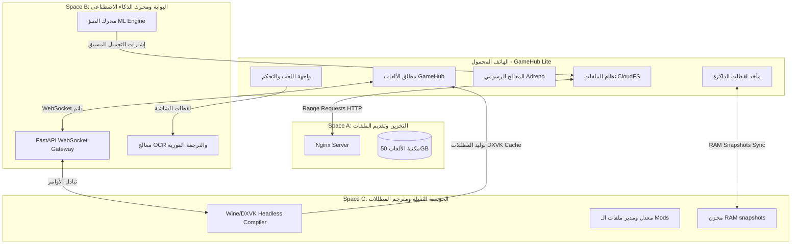

# مشروع GameHub Nexus: معمارية الحوسبة الهجينة الموزعة (GameHub Lite × Hugging Face Cluster)

## نظرة عامة على المشروع

الهدف هو دمج تطبيق **GameHub Lite** (مطلق الألعاب المفتوح المصدر لتشغيل ألعاب PC على Android) مع **عنقود مساحات Hugging Face (Multi-Space Cluster)** بحيث يصبح الهاتف ومجموعات الـ Spaces كياناً حوسبياً واحداً موزعاً ومتكاملاً. ليس الهدف مجرد "تخزين سحابي" بل تقسيم وتوزيع المهام بذكاء واستباقية ليعمل كل مورد في مجاله الأمثل وفي نفس الوقت لتخطي قيود الذاكرة، المعالجة، والتخزين.

---

## بنية العنقود ثلاثي المساحات (Triple-Space Cluster Architecture)

لتجنب قيود المساحة والذاكرة والمعالج في الخطط المجانية لـ Hugging Face (والتي تمنح 16GB RAM و 2 vCPU وتخزين 50GB لكل مساحة)، نقوم بتجزئة النظام إلى ثلاث مساحات متخصصة تعمل معاً بالتوازي:

```
┌────────────────────────────────────────────────────────────────────────┐
│                              NEXUS CLUSTER                             │
├─────────────────────┬───────────────────────────┬──────────────────────┤
│  Space A (Storage)  │     Space B (Gateway)     │  Space C (Compiler)  │
│  ─────────────────  │     ─────────────────     │  ──────────────────  │
│ ✅ تخزين ألعاب 50GB │ ✅ FastAPI WebSockets      │ ✅ محاكي Wine صامت   │
│ ✅ خادم Nginx سريع  │ ✅ محرك التنبؤ ML Engine  │ ✅ تجميع مظللات DXVK │
│ ✅ Range Requests   │ ✅ ترجمة فورية OCR/LLM    │ ✅ مدير تركيب الـMods│
└─────────────────────┴───────────────────────────┴──────────────────────┘
```



---

## الركائز الست للبنية الهجينة الموزعة (Core Pillars)

### Pillar 1: نظام الملفات السحابي المرن (GameHub CloudFS)
*   **الوظيفة:** تشغيل اللعبة مباشرة دون الحاجة لتحميلها بالكامل (On-demand Chunk Streaming).
*   **الآلية:** يتم دمج نظام ملفات افتراضي في كود GameHub Lite. عند تشغيل اللعبة، يرى Wine أن الملفات كاملة. بمجرد قراءة اللعبة لملف معين، يقوم `CloudFS` بسحب هذا الجزء تحديداً عبر HTTP Range Requests من **Space A** وتخزينه في الكاش المحلي للهاتف.
*   **النتيجة:** بدء الألعاب خلال ثوانٍ وتوفير 90% من مساحة الهاتف الفعلية.

### Pillar 2: التخلص من تقطيع الألعاب (Zero-Stutter Shader Pipeline)
*   **الوظيفة:** تفادي التقطيع المستمر (Micro-stuttering) الناتج عن ترجمة المظللات محلياً.
*   **الآلية:** يقوم **Space C** بتشغيل نسخة صامتة (Headless Shadow Emulation) للعبة، ويقوم بتجميع المظللات وتوليد ملفات `DXVK State Cache` متوافقة مع إعدادات الهاتف وإرسالها مضغوطة مسبقاً.
*   **النتيجة:** يقرأ الهاتف المظللات الجاهزة فوراً، مما يمنح تجربة لعب سلسة للغاية (60 FPS ثابتة).

### Pillar 3: محرك التنبؤ الذكي بالملفات (Predictive ML Prefetching)
*   **الوظيفة:** إلغاء شاشات التحميل أثناء اللعب.
*   **الآلية:** نموذج تعلم آلي متسلسل خفيف يعمل في **Space B** يراقب إحداثيات اللاعب وحالة اللعبة المرسلة عبر الـ WebSocket، ويتنبأ بالملفات والخامات التي سيطلبها محرك اللعبة بعد 10 ثوانٍ ويصدر أمراً لـ `CloudFS` بتحميلها وتجهيزها مسبقاً.

### Pillar 4: تعليق اللعبة وحفظ الذاكرة (Cloud RAM Swap & Snapshotting)
*   **الوظيفة:** التغلب على مشكلة إغلاق اللعبة المفاجئ بسبب امتلاء ذاكرة الهاتف (OOM Crash).
*   **الآلية:** أخذ لقطة كاملة للذاكرة الافتراضية للعبة (RAM Snapshot) وضغطها ورفع الفروقات (Memory Diffs) إلى **Space C**.
*   **النتيجة:** إمكانية إيقاف اللعبة بالكامل واستئنافها لاحقاً من نفس الإطار واللقطة، واستخدام الـ Space كذاكرة عشوائية ممتدة للهاتف.

### Pillar 5: معالج الذكاء الاصطناعي الرديف (AI Co-Processor)
*   **الوظيفة:** تقديم ترجمة فورية ومساعد ذكي دون إرهاق بطارية الهاتف.
*   **الآلية:** إرسال لقطات شاشة دورية منخفضة الدقة إلى **Space B** لتشغيل نماذج OCR والترجمة الفورية (العربية) ودمج النصوص كطبقة علوية (Overlay) فوق شاشة اللعب، مع تقديم صندوق نصائح ذكي (AI Coach) لحل الألغاز الصعبة.

### Pillar 6: تفويض المهام الثقيلة (Compute Offloading)
*   **الوظيفة:** تفويض المهام غير الرسومية التي تستهلك المعالج (CPU) والوقت.
*   **العمليات:** تنزيل وفك ضغط الألعاب، تهيئة وتثبيت الـ Wine Prefix، تركيب ودمج الـ Mods وتعديل الملفات، وتحويل ترميز الفيديوهات والصوتيات لتناسب الهاتف. كل هذا يتم في **Space C** سحابياً.

---

## القرارات المتفق عليها للتنفيذ (Decisions Made)

1.  **طريقة الدمج:** دمج وتعديل مباشر بلغة **Java/Kotlin** داخل كود GameHub Lite المصدري لسهولة وسلاسة البناء.
2.  **الاتصال بالملفات:** استخدام بروتوكول **HTTP Range Requests** عبر Nginx في **Space A** لضمان أعلى سرعة بث لملفات اللعبة.
3.  **التشفير والحماية:** **إلغاء التشفير مؤقتاً** لتقليل العبء الحسابي وزيادة سرعة الأداء وسرعة تطوير النموذج التجريبي الأولي.

---

## هيكل ملفات المشروع الموزع

```
gamehub-hf-hybrid/
│
├── hf-spaces/                         
│   ├── space-a-storage/               ← مساحة التخزين (Nginx)
│   │   ├── Dockerfile
│   │   ├── nginx.conf
│   │   └── games-catalog.json
│   │
│   ├── space-b-gateway/               ← مساحة الاتصال والذكاء الاصطناعي
│   │   ├── Dockerfile
│   │   ├── hf_server.py               (FastAPI + WebSockets)
│   │   ├── predictive_engine.py       (Sequential ML)
│   │   ├── ai_coprocessor.py          (OCR & Neural Translation)
│   │   └── requirements.txt
│   │
│   └── space-c-compute/               ← مساحة المعالجة وتجميع المظللات
│       ├── Dockerfile
│       ├── task_processor.py          (Wine prefix & Mod tasks)
│       ├── shader_compiler.py         (DXVK headless generator)
│       └── requirements.txt
│
└── gamehub-patches/                   ← تعديلات على GameHub Lite (Kotlin/Java)
    ├── extension/
    │   ├── HybridConnection.kt        (WebSocket مع Space B)
    │   ├── CloudFSProvider.kt         (سحب الملفات من Space A)
    │   ├── MemorySnapshotter.kt       (لقطات الذاكرة مع Space C)
    │   ├── TaskRouter.kt              (توجيه المهام)
    │   └── CacheManager.kt            (إدارة كاش الألعاب)
    └── patches/
        └── new_files/res/layout/
            └── hybrid_hud.xml         (واجهة التحكم السحابي المدمجة)
```

---

## بروتوكول الاتصال بين الأجهزة (Cluster API Protocols)

### رسائل WebSocket (JSON) عبر Space B:

```json
// الهاتف → Space B: تحديث إحداثيات ومكان اللاعب للتنبؤ
{
  "type": "player_position",
  "game_id": "gta_5",
  "x": 1420.5,
  "y": 322.1,
  "map_zone": "downtown",
  "timestamp": 1234567890
}

// Space B → الهاتف: إشارة تحميل مسبق لملف محدد
{
  "type": "prefetch_directive",
  "file_url": "https://[space_a_url]/games/gta_5/x64a.rpf",
  "byte_range": "104857600-115343360",
  "priority": "high"
}

// الهاتف → Space B: طلب الترجمة الفورية للصورة
{
  "type": "ocr_translate_request",
  "image_data": "base64_jpeg_data...",
  "target_lang": "ar"
}

// Space B → الهاتف: استجابة الترجمة الفورية
{
  "type": "ocr_translate_response",
  "translations": [
    {"text": "ابدأ اللعبة", "x": 100, "y": 200, "width": 50, "height": 20},
    {"text": "الإعدادات", "x": 100, "y": 250, "width": 50, "height": 20}
  ]
}
```

---

## خطة التحقق والاختبار (Verification Plan)

### الاختبارات التلقائية (Automated Tests)
1.  **اختبار سرعة البث (CloudFS Benchmarks):** قياس مدى تأخير استجابة `HTTP Range Requests` من **Space A** ومقارنتها بسرعة التحميل المطلوبة للعبة.
2.  **اختبار توافق الـ WebSockets:** محاكاة اتصال 10 أجهزة هواتف متزامنة بـ **Space B** للتحقق من أداء قنوات الاتصال والترجمة الفورية.

### التحقق اليدوي (Manual Verification)
1.  **اختبار تشغيل اللعبة السحابي:** التحقق من إمكانية بدء لعبة بحجم 20GB في أقل من 15 ثانية على الهاتف، والتأكد من بقاء المساحة المستهلكة أقل من 300MB.
2.  **اختبار الـ Shader Compilation:** اللعب لمدة 10 دقائق والتحقق من سلاسة الحركة وثبات الـ FPS بعد دمج ملفات `DXVK State Cache` المستلمة من **Space C**.
3.  **اختبار الترجمة الفورية:** التأكد من ظهور الترجمة العربية فوق نصوص اللعبة الأجنبية بشكل صحيح ومتناسق مع حوارات القصة والواجهات.
4.  **اختبار استرجاع الحالة (Cloud Resume):** إيقاف اللعبة تماماً على الهاتف، التأكد من حفظ الـ Snapshot في **Space C**، ثم استئنافها للتأكد من عودة اللعب لنفس الثانية بدقة.
